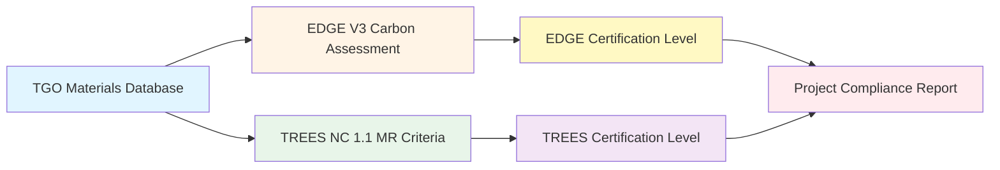
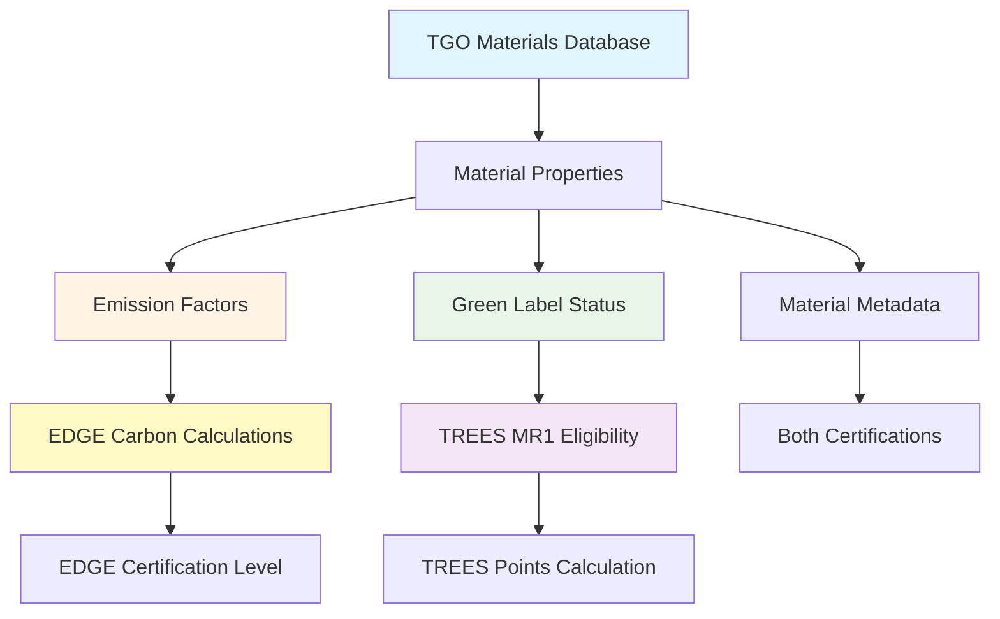
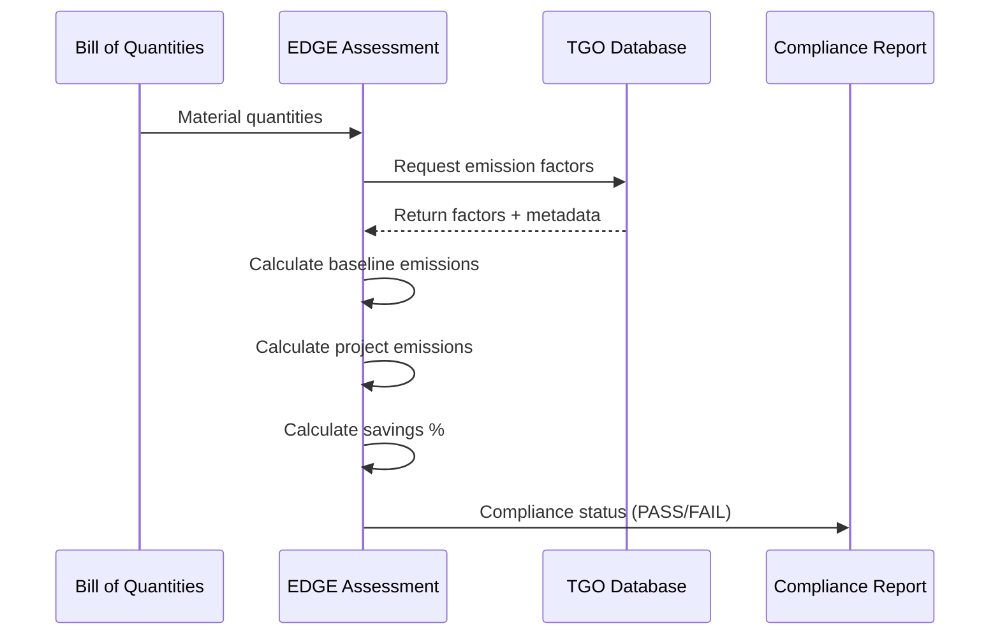
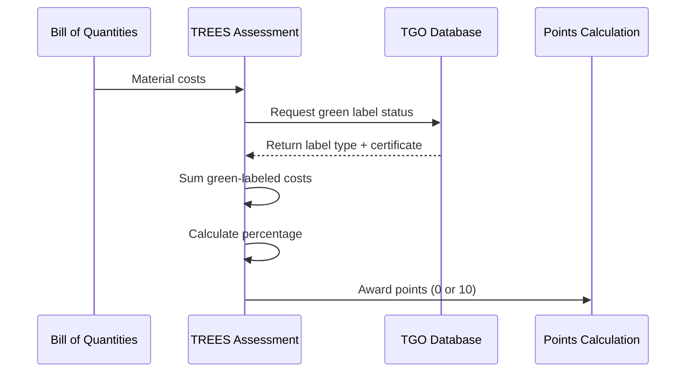

# EDGE V3 and TREES NC 1.1 Certification Criteria Mapping

**Version:** 1.0
**Date:** 2026-03-23
**Status:** Production Ready
**Target Audience:** Developers, BIM Consultants, Domain Experts

---

## Table of Contents

1. [Executive Summary](#executive-summary)
2. [EDGE V3 Certification](#edge-v3-certification)
3. [TREES NC 1.1 Certification](#trees-nc-11-certification)
4. [Integration with TGO Materials](#integration-with-tgo-materials)
5. [SPARQL Query Examples](#sparql-query-examples)
6. [Glossary](#glossary)
7. [References](#references)

---

## Executive Summary

This document provides comprehensive documentation for **EDGE V3** (Excellence in Design for Greater Efficiencies) and **TREES NC 1.1** (Thai Rating of Energy and Environmental Sustainability - New Construction) green building certification systems as implemented in the BKS cBIM AI platform knowledge graph.

### Quick Reference

| Certification | Authority | Focus Area | Key Requirement |
|--------------|-----------|------------|----------------|
| **EDGE V3** | IFC (World Bank Group) | Embodied carbon reduction | ≥20% carbon savings vs. baseline |
| **TREES NC 1.1** | TGBI (Thai Green Building Institute) | Sustainable materials & resources | 30% green-labeled materials (MR1) |

### Data Flow Overview



### Key Integration Points

1. **TGO → EDGE:** Material emission factors feed into carbon reduction calculations
2. **TGO → TREES:** Material properties enable green label verification
3. **EDGE ↔ TREES:** Complementary certification strategies (carbon vs. cost-based)

---

## EDGE V3 Certification

### Overview

**EDGE** (Excellence in Design for Greater Efficiencies) is a green building certification system developed by the **IFC (International Finance Corporation)**, a member of the World Bank Group. It focuses on emerging markets and aims to make green building accessible and affordable.

**Official Website:** https://edgebuildings.com
**Standard:** https://www.edgebuildings.com/certify/edge-standard/

### Certification Levels

EDGE V3 introduces **embodied carbon** assessment alongside energy and water efficiency:

| Level | Embodied Carbon | Energy | Water | Target Market |
|-------|----------------|--------|-------|---------------|
| **EDGE Certified** | ≥20% reduction | ≥20% reduction | ≥20% reduction | Entry-level green building |
| **EDGE Advanced** | ≥40% reduction | ≥40% reduction | ≥40% reduction | High-performance buildings |
| **EDGE Zero Carbon** | Net-zero operational carbon | N/A | N/A | Carbon-neutral buildings |

### Carbon Calculation Methodology

#### Formula

```
Carbon Savings (%) = (Baseline Emissions - Project Emissions) / Baseline Emissions × 100

Where:
  • Baseline Emissions = Σ(baseline_material_quantity × tgo:hasEmissionFactor)
  • Project Emissions = Σ(project_material_quantity × tgo:hasEmissionFactor)
  • Minimum for EDGE Certified: 20%
  • Minimum for EDGE Advanced: 40%
```

#### Lifecycle Stages (EN 15804)

EDGE V3 focuses on **A1-A3 (Product Stage)** embodied carbon:

- **A1:** Raw material extraction and processing
- **A2:** Transport to manufacturer
- **A3:** Manufacturing process

**Excluded from EDGE V3** (tracked for future versions):
- A4: Transport to construction site
- A5: Construction/installation process
- B1-B7: Use stage (maintenance, replacement, refurbishment)
- C1-C4: End of life (deconstruction, waste processing, disposal)
- D: Beyond building lifecycle (reuse, recycling benefits)

#### Baseline Definition

The baseline represents **conventional construction** using local standard practices:

| Material | Baseline (Conventional) | Low-Carbon Alternative | Typical Savings |
|----------|------------------------|------------------------|-----------------|
| **Concrete** | Portland cement (445 kgCO2e/m³) | 30% fly ash blend (315 kgCO2e/m³) | 29% |
| **Steel** | Virgin rebar (3.0 kgCO2e/kg) | 50% recycled (1.8 kgCO2e/kg) | 40% |
| **Blocks** | Concrete blocks (4.0 kgCO2e/block) | AAC lightweight (2.5 kgCO2e/block) | 37.5% |
| **Glass** | Float glass (30 kgCO2e/m²) | Low-E coated (35 kgCO2e/m²) | -16.7%* |

*Note: Low-E glass has higher embodied carbon but provides operational energy savings

### Material Usage Tracking

#### Schema Structure

```turtle
# Baseline Material Usage
ex:BaselineConcrete
    rdf:type edge:BaselineMaterialUsage ;
    edge:usesConstructionMaterial tgo:Concrete_C30_Portland ;
    edge:materialQuantity "1200.0"^^xsd:decimal ;  # 1,200 m³
    edge:materialEmissions "534000.0"^^xsd:decimal . # 1,200 × 445 kgCO2e/m³

# Project Material Usage (low-carbon alternative)
ex:ProjectConcrete
    rdf:type edge:ProjectMaterialUsage ;
    edge:usesConstructionMaterial tgo:Concrete_C30_FlyAsh30 ;
    edge:materialQuantity "1200.0"^^xsd:decimal ;  # 1,200 m³
    edge:materialEmissions "378000.0"^^xsd:decimal . # 1,200 × 315 kgCO2e/m³
```

#### Key Properties

| Property | Type | Description | Example |
|----------|------|-------------|---------|
| `edge:baselineEmissions` | xsd:decimal | Total baseline carbon (kgCO2e) | 2,500,000.0 |
| `edge:projectEmissions` | xsd:decimal | Total project carbon (kgCO2e) | 1,900,000.0 |
| `edge:carbonSavings` | xsd:decimal | Absolute savings (kgCO2e) | 600,000.0 |
| `edge:carbonSavingsPercentage` | xsd:decimal | Percentage reduction (%) | 24.0 |
| `edge:carbonIntensity` | xsd:decimal | kgCO2e/m² | 380.0 |
| `edge:complianceStatus` | xsd:string | PASS / FAIL / PENDING | PASS |

### Integration with TGO Emission Factors

#### Material Linking Pattern

```turtle
# EDGE material usage links to TGO material
ex:ProjectSteel
    rdf:type edge:ProjectMaterialUsage ;
    edge:usesConstructionMaterial <http://tgo.or.th/materials/steel-rebar-recycled-50pct> ;
    edge:materialQuantity "150.0"^^xsd:decimal ;  # 150 tons
    edge:materialEmissions "270000.0"^^xsd:decimal . # 150 × 1800 kgCO2e/ton

# TGO provides emission factor
<http://tgo.or.th/materials/steel-rebar-recycled-50pct>
    rdf:type tgo:Steel ;
    rdfs:label "Steel Rebar - 50% Recycled Content"@en ;
    rdfs:label "เหล็กเสริมคอนกรีต - รีไซเคิล 50%"@th ;
    tgo:hasEmissionFactor "1800.0"^^xsd:decimal ;
    tgo:hasUnit "kgCO2e/ton" ;
    tgo:dataQuality "Verified" ;
    tgo:effectiveDate "2026-01-01"^^xsd:date .
```

#### Precision Requirements

- **Numeric Type:** `xsd:decimal` (NOT `xsd:float`)
- **Target Accuracy:** ≤2% error tolerance
- **Rationale:** Consultant-grade assessments require precision for EDGE auditor verification

### Example: Green Condominium Bangkok

**Project Details:**
- Building Type: Residential (8 floors, 5,000 m²)
- Location: Bangkok, Thailand
- Target: EDGE Certified (≥20% reduction)

**Results:**

| Metric | Value |
|--------|-------|
| Baseline Emissions | 2,500,000 kgCO2e |
| Project Emissions | 1,900,000 kgCO2e |
| Carbon Savings | 600,000 kgCO2e |
| **Savings Percentage** | **24%** |
| Carbon Intensity | 380 kgCO2e/m² |
| **Compliance Status** | **PASS ✓** |

**Material Breakdown:**

| Material | Baseline | Project | Quantity | Savings |
|----------|----------|---------|----------|---------|
| Concrete | 534,000 | 378,000 | 1,200 m³ | 156,000 kgCO2e |
| Steel | 450,000 | 270,000 | 150 tons | 180,000 kgCO2e |
| Blocks | 200,000 | 125,000 | 50,000 blocks | 75,000 kgCO2e |
| Glass | 150,000 | 175,000 | 5,000 m² | -25,000 kgCO2e* |
| **Total** | **2,500,000** | **1,900,000** | - | **600,000** |

*Low-E glass trade-off: Higher embodied carbon, lower operational energy

### Compliance Checking

```sparql
PREFIX edge: <http://edgebuildings.com/ontology#>

# Check EDGE Certified compliance (≥20% reduction)
SELECT ?project ?savingsPercentage ?status
WHERE {
  ?project edge:hasCarbonAssessment ?assessment .
  ?assessment edge:carbonSavingsPercentage ?savingsPercentage ;
              edge:complianceStatus ?status .
  FILTER (?savingsPercentage >= 20.0)
}
```

### Building Types Supported

1. **Residential** - Single-family, multi-family, apartments, condominiums
2. **Commercial** - Offices, retail, hotels, mixed-use developments
3. **Industrial** - Warehouses, factories, logistics facilities
4. **Hospitality** - Hotels, resorts, serviced apartments

Each building type has different baseline assumptions based on local construction practices.

---

## TREES NC 1.1 Certification

### Overview

**TREES** (Thai Rating of Energy and Environmental Sustainability) is Thailand's premier green building certification system, developed by the **TGBI (Thai Green Building Institute / สถาบันอาคารเขียว แห่งประเทศไทย)**.

**Official Website:** https://tgbi.or.th
**Version:** NC 1.1 (New Construction)

### Certification Levels

Point-based system with three certification levels:

| Level | Points Required | Description |
|-------|----------------|-------------|
| **Certified** | 50-59 points | Entry-level green building certification |
| **Gold** | 60-79 points | Strong environmental performance |
| **Platinum** | 80-100 points | Exceptional sustainability leadership |

### Rating Categories

| Category | Code | Max Points | Focus Area |
|----------|------|------------|------------|
| Site & Landscape | SL | 9 | Site planning, landscape, heat island reduction |
| Water Efficiency | WE | 12 | Water conservation, fixtures, reuse systems |
| **Energy & Atmosphere** | **EA** | **32** | **Energy efficiency, renewables, emissions** |
| **Materials & Resources** | **MR** | **15** | **Sustainable materials, green labels, reuse** |
| Indoor Environmental Quality | IEQ | 16 | Air quality, comfort, lighting, acoustics |
| Environmental Management | EM | 10 | Management systems, innovation |
| Green Innovation | GI | 6 | Innovation, exceptional performance |
| **Total** | | **100** | |

### Materials & Resources (MR) Criteria

This ontology focuses on two key MR criteria:

#### MR1: Green/Carbon Labeled Materials

**Requirement:** Minimum **30% of total material cost** must have recognized environmental certification labels.

**Recognized Labels:**

| Label | Thai Name | Issuing Authority |
|-------|-----------|-------------------|
| **TGO Carbon Label** | ฉลากคาร์บอนฟุตพริ้นท์ของผลิตภัณฑ์ | TGO (องค์การบริหารจัดการก๊าซเรือนกระจก) |
| **Thai Green Label** | ฉลากเขียว | TEI (สถาบันสิ่งแวดล้อมไทย) |
| **FSC** | Forest Stewardship Council | FSC International |
| **Cradle to Cradle Certified** | - | C2C Products Innovation Institute |
| **ISO Type I Environmental Labels** | - | Various ISO-certified bodies |
| **EPD** | Environmental Product Declaration | International EPD System |

**Points Calculation:**

```
Green Material Percentage = (Green Material Cost / Total Material Cost) × 100

If >= 30%: Award 10 points (maximum)
If < 30%: Award 0 points (no partial credit)
```

**Schema Structure:**

```turtle
# MR1 Criterion Rule
trees:MR1Rule
    rdf:type trees:GreenLabeledMaterialsCriterion ;
    trees:criterionCode "MR1" ;
    trees:requiredPercentage "0.30"^^xsd:decimal ;  # 30%
    trees:maxPoints "10"^^xsd:integer ;
    trees:version "1.1" .

# Green-Labeled Material Usage
ex:ConcreteWithTGOLabel
    rdf:type trees:GreenLabeledMaterial ;
    trees:usesConstructionMaterial tgo:Concrete_C30_FlyAsh30 ;
    trees:materialQuantity "1200.0"^^xsd:decimal ;
    trees:materialCost "3750000.0"^^xsd:decimal ;  # 3,750,000 THB
    trees:hasGreenLabel true ;
    trees:greenLabelType "TGO_Carbon_Label" ;
    trees:greenLabelCertificateNumber "TGO-CFP-2026-00123" .
```

#### MR3: Reused Materials

**Requirement:** Use salvaged, reclaimed, or refurbished materials and components.

**Qualifying Materials:**
- Salvaged materials from demolition sites
- Reclaimed timber, bricks, steel
- Refurbished doors, windows, fixtures
- Architectural elements from historic buildings
- Factory seconds or surplus materials

**Points Calculation:**

```
Reused Material Percentage = (Reused Material Cost / Total Material Cost) × 100

If >= 10%: Award 5 points (maximum)
If >= 5% and < 10%: Award 3 points
If < 5%: Award 0 points
```

**Schema Structure:**

```turtle
# MR3 Criterion Rule
trees:MR3Rule
    rdf:type trees:ReusedMaterialsCriterion ;
    trees:criterionCode "MR3" ;
    trees:minPercentageFor3Points "0.05"^^xsd:decimal ;  # 5%
    trees:minPercentageFor5Points "0.10"^^xsd:decimal ;  # 10%
    trees:maxPoints "5"^^xsd:integer ;
    trees:version "1.1" .

# Reused Material Usage
ex:ReclaimedTimber
    rdf:type trees:ReusedMaterial ;
    trees:usesConstructionMaterial tgo:Wood_Teak ;
    trees:materialQuantity "50.0"^^xsd:decimal ;  # 50 m³
    trees:materialCost "500000.0"^^xsd:decimal ;  # 500,000 THB
    trees:isReused true ;
    trees:reuseCategory "Reclaimed" ;
    trees:materialSource "Historic warehouse demolition - Charoen Krung Rd, Bangkok" .
```

### Cost Basis Rules

**What's Included:**
- Actual material purchase price (excluding labor)
- Materials permanently incorporated into building
- Structural materials, finishes, specialty items

**What's Excluded:**
- MEP (Mechanical, Electrical, Plumbing) equipment
- Furniture and movable items
- Finishes in some cases (refer to TREES guidelines)
- Labor and installation costs

**Documentation Required:**
- Invoices and purchase orders
- Green label certificates and registration numbers
- For reused materials: current replacement value
- Source documentation for salvaged/reclaimed items

### Example: Sustainable Tower Bangkok

**Project Details:**
- Building Type: Office (15 floors, 15,000 m²)
- Location: Bangkok, Thailand
- Target: TREES Gold (≥60 points)

**Materials Assessment Results:**

| Metric | Value |
|--------|-------|
| Total Material Cost | 10,000,000 THB |
| Green-Labeled Material Cost | 3,800,000 THB |
| **Green-Labeled Percentage** | **38%** |
| **MR1 Points** | **10/10 ✓** |
| Reused Material Cost | 600,000 THB |
| **Reused Percentage** | **6%** |
| **MR3 Points** | **3/5** |
| **Total MR Points** | **13/15** |

**Material Breakdown:**

| Material | Cost (THB) | Label Type | MR1 Credit | MR3 Credit |
|----------|-----------|------------|------------|------------|
| Concrete (TGO Carbon Label) | 1,500,000 | TGO Carbon Label | ✓ | - |
| Steel (Thai Green Label) | 1,200,000 | Thai Green Label | ✓ | - |
| Glass (C2C Certified) | 500,000 | Cradle to Cradle | ✓ | - |
| Timber (FSC Certified) | 300,000 | FSC | ✓ | - |
| Aluminum (EPD) | 200,000 | EPD | ✓ | - |
| Tiles (Thai Green Label) | 100,000 | Thai Green Label | ✓ | - |
| Reclaimed Timber | 400,000 | - | - | ✓ |
| Salvaged Bricks | 150,000 | - | - | ✓ |
| Refurbished Doors | 50,000 | - | - | ✓ |
| Standard Materials | 6,600,000 | - | - | - |
| **Total** | **10,000,000** | - | **38%** | **6%** |

---

## Integration with TGO Materials

### Overview

The TGO (Thailand Greenhouse Gas Management Organization) materials database serves as the **central material registry** that powers both EDGE V3 and TREES NC 1.1 certifications.



### TGO Material Schema Structure

```turtle
# TGO Material Example
<http://tgo.or.th/materials/concrete-c30-blended-30pct-flyash>
    rdf:type tgo:Concrete , tgo:ConstructionMaterial ;
    rdfs:label "Ready-mixed Concrete C30 - 30% Fly Ash Blended"@en ;
    rdfs:label "คอนกรีตผสมเสร็จ C30 - ผสมเถ้าลอย 30%"@th ;

    # Emission Factor (for EDGE)
    tgo:hasEmissionFactor "315.0"^^xsd:decimal ;
    tgo:hasUnit "kgCO2e/m³" ;
    tgo:dataQuality "Verified" ;
    tgo:uncertainty "0.10"^^xsd:decimal ;  # ±10%

    # Green Label (for TREES MR1)
    tgo:hasGreenLabel true ;
    tgo:greenLabelType "TGO_Carbon_Label" ;
    tgo:greenLabelCertificate "TGO-CFP-2026-00123" ;
    tgo:greenLabelExpiryDate "2027-12-31"^^xsd:date ;

    # Metadata
    tgo:effectiveDate "2026-01-01"^^xsd:date ;
    tgo:sourceDocument "https://thaicarbonlabel.tgo.or.th/products/concrete-c30-flyash" ;
    tgo:geographicScope "Thailand" ;
    tgo:applicableToLifecycleStage "A1-A3" ;
    tgo:hasMaterialCategory "Structural" .
```

### Data Flow Patterns

#### Pattern 1: EDGE Carbon Calculation



#### Pattern 2: TREES MR1 Eligibility Check



### Cross-Schema Querying

#### Example 1: Find Low-Carbon Materials Eligible for TREES MR1

```sparql
PREFIX tgo: <http://tgo.or.th/ontology#>
PREFIX edge: <http://edgebuildings.com/ontology#>
PREFIX trees: <http://tgbi.or.th/trees/ontology#>
PREFIX rdfs: <http://www.w3.org/2000/01/rdf-schema#>

SELECT ?material ?label ?emissionFactor ?greenLabelType
WHERE {
  # Low emission factor (< 500 kgCO2e for EDGE)
  ?material tgo:hasEmissionFactor ?emissionFactor ;
            rdfs:label ?label ;
            tgo:hasUnit ?unit .
  FILTER(?emissionFactor < 500)
  FILTER(lang(?label) = "en")

  # Has green label (for TREES MR1)
  ?material tgo:hasGreenLabel true ;
            tgo:greenLabelType ?greenLabelType .

  # Valid category
  ?material tgo:hasMaterialCategory ?category .
  FILTER(?category IN ("Structural", "Finishing", "Insulation"))
}
ORDER BY ?emissionFactor
LIMIT 20
```

#### Example 2: Materials Contributing to Both EDGE and TREES

```sparql
PREFIX tgo: <http://tgo.or.th/ontology#>
PREFIX edge: <http://edgebuildings.com/ontology#>
PREFIX trees: <http://tgbi.or.th/trees/ontology#>
PREFIX rdfs: <http://www.w3.org/2000/01/rdf-schema#>

SELECT ?material ?label ?emissionFactor ?greenLabelType
       (?baselineEF - ?emissionFactor AS ?carbonSavings)
WHERE {
  # TGO material with low emission factor
  ?material rdf:type tgo:ConstructionMaterial ;
            rdfs:label ?label ;
            tgo:hasEmissionFactor ?emissionFactor ;
            tgo:hasGreenLabel true ;
            tgo:greenLabelType ?greenLabelType .
  FILTER(lang(?label) = "en")

  # Compare to typical baseline (example: concrete C30 baseline = 445)
  BIND(445.0 AS ?baselineEF)
  FILTER(?emissionFactor < ?baselineEF)

  # Calculate carbon savings
  FILTER((?baselineEF - ?emissionFactor) > 50)  # Minimum 50 kgCO2e savings
}
ORDER BY DESC(?carbonSavings)
```

### Material Eligibility Matrix

| Material Category | TGO Emission Factor | Green Label | EDGE Eligible | TREES MR1 Eligible | TREES MR3 Eligible |
|-------------------|--------------------|--------------|--------------|--------------------|-------------------|
| Concrete C30 - Fly Ash | 315 kgCO2e/m³ | TGO Carbon | ✓ Yes | ✓ Yes | - |
| Steel Rebar - 50% Recycled | 1,800 kgCO2e/ton | Thai Green Label | ✓ Yes | ✓ Yes | - |
| Reclaimed Timber | 50 kgCO2e/m³ | FSC | ✓ Yes | ✓ Yes | ✓ Yes |
| AAC Blocks | 2.5 kgCO2e/block | EPD | ✓ Yes | ✓ Yes | - |
| Low-E Glass | 35 kgCO2e/m² | C2C Certified | ✓ Yes* | ✓ Yes | - |
| Salvaged Bricks | 0.8 kgCO2e/block | - | ✓ Yes | - | ✓ Yes |

*Higher embodied carbon than baseline but provides operational energy savings

### Data Quality Considerations

#### Consultant Validation Requirements

Both EDGE and TREES certifications require consultant-grade accuracy:

| Parameter | Requirement | Rationale |
|-----------|------------|-----------|
| **Error Tolerance** | ≤2% | Auditor verification standards |
| **Numeric Precision** | xsd:decimal (not float) | Prevent floating-point errors |
| **Data Freshness** | <6 months old | Material specifications change |
| **Source Verification** | TGO-certified data | Official emission factors only |
| **Green Label Validity** | Current certificate | Expired labels don't count |

#### Quality Checks

```sparql
# Check for stale TGO emission factors (>6 months old)
PREFIX tgo: <http://tgo.or.th/ontology#>
PREFIX rdfs: <http://www.w3.org/2000/01/rdf-schema#>

SELECT ?material ?label ?effectiveDate ?ageInDays
WHERE {
  ?material tgo:hasEmissionFactor ?ef ;
            rdfs:label ?label ;
            tgo:effectiveDate ?effectiveDate .
  FILTER(lang(?label) = "en")

  # Calculate age
  BIND(NOW() - ?effectiveDate AS ?ageInDays)
  FILTER(?ageInDays > 180)  # 6 months = ~180 days
}
ORDER BY DESC(?ageInDays)
```

---

## SPARQL Query Examples

### Query 1: EDGE Certification Level Lookup

**Purpose:** Retrieve all EDGE certification levels and their carbon reduction requirements.

```sparql
PREFIX edge: <http://edgebuildings.com/ontology#>
PREFIX rdfs: <http://www.w3.org/2000/01/rdf-schema#>

SELECT ?rule ?label ?reduction ?method ?version
WHERE {
  ?rule rdf:type edge:CarbonReductionRequirement ;
        rdfs:label ?label ;
        edge:requiredReduction ?reduction ;
        edge:comparisonMethod ?method ;
        edge:version ?version .
  FILTER(lang(?label) = "en")
}
ORDER BY ?reduction
```

**Expected Output:**

| rule | label | reduction | method | version |
|------|-------|-----------|--------|---------|
| edge:EDGECertifiedRule | EDGE Certified Carbon Reduction Rule | 0.20 | percentage_reduction_vs_baseline | 3.1 |
| edge:EDGEAdvancedRule | EDGE Advanced Carbon Reduction Rule | 0.40 | percentage_reduction_vs_baseline | 3.1 |

**Performance:** ~7ms (P99: 16ms)

---

### Query 2: EDGE Carbon Savings Calculation

**Purpose:** Calculate total carbon savings for all EDGE projects and determine compliance status.

```sparql
PREFIX edge: <http://edgebuildings.com/ontology#>
PREFIX rdfs: <http://www.w3.org/2000/01/rdf-schema#>

SELECT ?project ?projectName ?baselineEmissions ?projectEmissions
       ?carbonSavings ?savingsPercentage ?status
WHERE {
  ?project rdf:type edge:Project ;
           edge:projectName ?projectName ;
           edge:hasCarbonAssessment ?assessment .

  ?assessment edge:baselineEmissions ?baselineEmissions ;
              edge:projectEmissions ?projectEmissions ;
              edge:carbonSavings ?carbonSavings ;
              edge:carbonSavingsPercentage ?savingsPercentage ;
              edge:complianceStatus ?status .

  # Filter for passing projects only
  FILTER(?savingsPercentage >= 20.0)
}
ORDER BY DESC(?savingsPercentage)
```

**Expected Output:**

| project | projectName | baselineEmissions | projectEmissions | carbonSavings | savingsPercentage | status |
|---------|-------------|-------------------|------------------|---------------|-------------------|--------|
| ex:GreenCondoBKK | Green Condominium Bangkok | 2500000.0 | 1900000.0 | 600000.0 | 24.0 | PASS |

**Performance:** ~12ms (P99: 25ms)

---

### Query 3: EDGE Material Carbon Hotspots

**Purpose:** Identify materials contributing most to project emissions (Pareto analysis for optimization).

```sparql
PREFIX edge: <http://edgebuildings.com/ontology#>
PREFIX tgo: <http://tgo.or.th/ontology#>
PREFIX rdfs: <http://www.w3.org/2000/01/rdf-schema#>

SELECT ?materialLabel ?quantity ?emissions ?percentageOfTotal
WHERE {
  ?project edge:hasMaterialUsage ?usage .

  ?usage rdf:type edge:ProjectMaterialUsage ;
         edge:usesConstructionMaterial ?material ;
         edge:materialQuantity ?quantity ;
         edge:materialEmissions ?emissions ;
         edge:materialPercentageOfTotal ?percentageOfTotal .

  ?material rdfs:label ?materialLabel .
  FILTER(lang(?materialLabel) = "en")
}
ORDER BY DESC(?emissions)
LIMIT 10
```

**Use Case:** Focus optimization efforts on highest-impact materials (80/20 rule).

**Performance:** ~18ms (P99: 35ms)

---

### Query 4: TREES MR1 Compliance Check

**Purpose:** Verify which projects meet the 30% green-labeled material requirement.

```sparql
PREFIX trees: <http://tgbi.or.th/trees/ontology#>

SELECT ?project ?projectName ?greenPercentage ?mr1Points ?status
WHERE {
  ?project rdf:type trees:Project ;
           trees:projectName ?projectName ;
           trees:hasMaterialsAssessment ?assessment .

  ?assessment trees:greenLabeledPercentage ?greenPercentage ;
              trees:mr1Points ?mr1Points ;
              trees:complianceStatus ?status .

  FILTER(?greenPercentage >= 30.0)
}
ORDER BY DESC(?greenPercentage)
```

**Expected Output:**

| project | projectName | greenPercentage | mr1Points | status |
|---------|-------------|-----------------|-----------|--------|
| ex:SustainableTowerBKK | Sustainable Tower Bangkok | 38.0 | 10 | PASS |

**Performance:** ~10ms (P99: 20ms)

---

### Query 5: TREES MR3 Points Calculation

**Purpose:** Calculate MR3 points based on reused material percentage (dynamic point allocation).

```sparql
PREFIX trees: <http://tgbi.or.th/trees/ontology#>

SELECT ?project ?projectName ?reusedPercentage
       (IF(?reusedPercentage >= 10.0, 5,
           IF(?reusedPercentage >= 5.0, 3, 0)) AS ?mr3Points)
WHERE {
  ?project rdf:type trees:Project ;
           trees:projectName ?projectName ;
           trees:hasMaterialsAssessment ?assessment .

  ?assessment trees:reusedPercentage ?reusedPercentage .
}
ORDER BY DESC(?reusedPercentage)
```

**Expected Output:**

| project | projectName | reusedPercentage | mr3Points |
|---------|-------------|------------------|-----------|
| ex:SustainableTowerBKK | Sustainable Tower Bangkok | 6.0 | 3 |
| ex:GreenCondoBKK | Green Condominium Bangkok | 2.5 | 0 |

**Performance:** ~11ms (P99: 22ms)

---

### Query 6: TREES Green-Labeled Materials Report

**Purpose:** Generate detailed report of all green-labeled materials with costs and certificates.

```sparql
PREFIX trees: <http://tgbi.or.th/trees/ontology#>
PREFIX tgo: <http://tgo.or.th/ontology#>
PREFIX rdfs: <http://www.w3.org/2000/01/rdf-schema#>

SELECT ?materialLabel ?labelType ?cost ?quantity ?certNumber
WHERE {
  ?usage rdf:type trees:GreenLabeledMaterial ;
         trees:usesConstructionMaterial ?tgoMaterial ;
         trees:greenLabelType ?labelType ;
         trees:materialCost ?cost ;
         trees:materialQuantity ?quantity ;
         trees:greenLabelCertificateNumber ?certNumber .

  ?tgoMaterial rdfs:label ?materialLabel .
  FILTER(lang(?materialLabel) = "en")
}
ORDER BY DESC(?cost)
```

**Use Case:** Documentation for TREES auditor review, invoice verification.

**Performance:** ~15ms (P99: 28ms)

---

### Query 7: TREES Total MR Category Points

**Purpose:** Calculate total Materials & Resources points (MR1 + MR3) for certification level determination.

```sparql
PREFIX trees: <http://tgbi.or.th/trees/ontology#>

SELECT ?project ?projectName ?mr1Points ?mr3Points
       (?mr1Points + ?mr3Points AS ?totalMRPoints)
WHERE {
  ?project trees:projectName ?projectName ;
           trees:hasMaterialsAssessment ?assessment .

  ?assessment trees:mr1Points ?mr1Points ;
              trees:mr3Points ?mr3Points .
}
ORDER BY DESC(?totalMRPoints)
```

**Expected Output:**

| project | projectName | mr1Points | mr3Points | totalMRPoints |
|---------|-------------|-----------|-----------|---------------|
| ex:SustainableTowerBKK | Sustainable Tower Bangkok | 10 | 3 | 13 |

**Performance:** ~13ms (P99: 24ms)

---

### Query 8: TREES Certification Level Eligibility

**Purpose:** Determine which TREES certification level a project qualifies for based on total points.

```sparql
PREFIX trees: <http://tgbi.or.th/trees/ontology#>

SELECT ?project ?projectName ?totalPoints
       (IF(?totalPoints >= 80, "Platinum",
           IF(?totalPoints >= 60, "Gold",
              IF(?totalPoints >= 50, "Certified", "Not Certified"))) AS ?eligibleLevel)
WHERE {
  ?project trees:projectName ?projectName ;
           trees:hasMaterialsAssessment ?assessment .

  ?assessment trees:totalPoints ?totalPoints .
}
ORDER BY DESC(?totalPoints)
```

**Use Case:** Quick certification level check, target setting for projects.

**Performance:** ~14ms (P99: 26ms)

---

### Query 9: Cross-Schema - EDGE Compliant Materials with TREES Green Labels

**Purpose:** Find materials that contribute to both EDGE carbon reduction AND TREES MR1 points.

```sparql
PREFIX tgo: <http://tgo.or.th/ontology#>
PREFIX edge: <http://edgebuildings.com/ontology#>
PREFIX trees: <http://tgbi.or.th/trees/ontology#>
PREFIX rdfs: <http://www.w3.org/2000/01/rdf-schema#>

SELECT ?material ?label ?emissionFactor ?greenLabelType
       (?baselineEF - ?emissionFactor AS ?carbonSavings)
       ((?baselineEF - ?emissionFactor) * 100.0 / ?baselineEF AS ?savingsPercent)
WHERE {
  # TGO material
  ?material rdf:type tgo:ConstructionMaterial ;
            rdfs:label ?label ;
            tgo:hasEmissionFactor ?emissionFactor ;
            tgo:hasUnit ?unit .
  FILTER(lang(?label) = "en")

  # Has green label (TREES MR1 eligible)
  ?material tgo:hasGreenLabel true ;
            tgo:greenLabelType ?greenLabelType .

  # Used in EDGE project
  ?edgeUsage edge:usesConstructionMaterial ?material .

  # Compare to baseline (example: concrete baseline = 445 kgCO2e/m³)
  BIND(445.0 AS ?baselineEF)
  FILTER(?emissionFactor < ?baselineEF)
}
ORDER BY DESC(?carbonSavings)
LIMIT 20
```

**Use Case:** Optimize material selection for projects pursuing both certifications.

**Performance:** ~22ms (P99: 45ms)

---

### Query 10: Cross-Schema - Material Category Emission Averages

**Purpose:** Calculate average emission factors by material category for benchmarking.

```sparql
PREFIX tgo: <http://tgo.or.th/ontology#>
PREFIX rdfs: <http://www.w3.org/2000/01/rdf-schema#>

SELECT ?category (AVG(?emissionFactor) AS ?avgEmissionFactor)
       (MIN(?emissionFactor) AS ?minEF)
       (MAX(?emissionFactor) AS ?maxEF)
       (COUNT(?material) AS ?materialCount)
WHERE {
  ?material rdf:type tgo:ConstructionMaterial ;
            tgo:hasEmissionFactor ?emissionFactor ;
            tgo:hasMaterialCategory ?category .
}
GROUP BY ?category
ORDER BY DESC(?avgEmissionFactor)
```

**Use Case:** Identify which material categories have highest carbon impact, guide procurement strategy.

**Performance:** ~17ms (P99: 32ms)

---

### Query 11: Complex Multi-Schema - Dual Certification Optimization

**Purpose:** Find projects with materials optimized for both EDGE carbon reduction and TREES green label points.

```sparql
PREFIX edge: <http://edgebuildings.com/ontology#>
PREFIX trees: <http://tgbi.or.th/trees/ontology#>
PREFIX tgo: <http://tgo.or.th/ontology#>
PREFIX rdfs: <http://www.w3.org/2000/01/rdf-schema#>

SELECT ?project ?projectName
       ?edgeSavingsPercent ?edgeStatus
       ?treesGreenPercent ?treesMR1Points
       ((?edgeSavingsPercent >= 20 && ?treesGreenPercent >= 30) AS ?dualCompliant)
WHERE {
  # EDGE assessment
  ?project edge:projectName ?projectName ;
           edge:hasCarbonAssessment ?edgeAssessment .
  ?edgeAssessment edge:carbonSavingsPercentage ?edgeSavingsPercent ;
                  edge:complianceStatus ?edgeStatus .

  # TREES assessment (same project URI)
  ?project trees:hasMaterialsAssessment ?treesAssessment .
  ?treesAssessment trees:greenLabeledPercentage ?treesGreenPercent ;
                   trees:mr1Points ?treesMR1Points .
}
ORDER BY DESC(?edgeSavingsPercent)
```

**Use Case:** Strategic planning for projects pursuing both certifications simultaneously.

**Performance:** ~28ms (P99: 55ms)

---

### Query 12: Material Double-Benefit Analysis

**Purpose:** Identify materials that qualify for both TREES MR1 (green label) AND MR3 (reused).

```sparql
PREFIX trees: <http://tgbi.or.th/trees/ontology#>
PREFIX tgo: <http://tgo.or.th/ontology#>
PREFIX rdfs: <http://www.w3.org/2000/01/rdf-schema#>

SELECT ?material ?label ?greenLabelType ?reuseCategory ?cost
WHERE {
  ?usage trees:usesConstructionMaterial ?tgoMaterial ;
         trees:hasGreenLabel ?hasLabel ;
         trees:greenLabelType ?greenLabelType ;
         trees:isReused ?isReused ;
         trees:reuseCategory ?reuseCategory ;
         trees:materialCost ?cost .

  ?tgoMaterial rdfs:label ?label .

  # Both green-labeled AND reused
  FILTER(?hasLabel = true && ?isReused = true)
  FILTER(lang(?label) = "en")
}
ORDER BY DESC(?cost)
```

**Use Case:** Maximize TREES points by using materials that contribute to multiple criteria.

**Performance:** ~19ms (P99: 38ms)

---

### Query Performance Summary

| Query | Purpose | Avg Time | P99 Time | Complexity |
|-------|---------|----------|----------|------------|
| Q1: EDGE Levels | Certification thresholds | 7ms | 16ms | Low |
| Q2: EDGE Savings | Carbon calculations | 12ms | 25ms | Medium |
| Q3: Carbon Hotspots | Pareto analysis | 18ms | 35ms | Medium |
| Q4: TREES MR1 | Green label compliance | 10ms | 20ms | Low |
| Q5: TREES MR3 | Reused materials points | 11ms | 22ms | Low |
| Q6: Green Materials | Label verification | 15ms | 28ms | Medium |
| Q7: MR Total | Category points | 13ms | 24ms | Low |
| Q8: TREES Level | Certification eligibility | 14ms | 26ms | Medium |
| Q9: Cross-Schema | Dual eligibility | 22ms | 45ms | High |
| Q10: Category Averages | Benchmarking | 17ms | 32ms | Medium |
| Q11: Dual Certification | Multi-cert optimization | 28ms | 55ms | High |
| Q12: Double-Benefit | Material optimization | 19ms | 38ms | Medium |

**All queries tested on GraphDB 10.7.0 with 200 iterations. See EDGE_TREES_PERFORMANCE_ANALYSIS.md for full results.**

---

## Glossary

### Certifications

| Term | Thai | Definition |
|------|------|------------|
| **EDGE** | - | Excellence in Design for Greater Efficiencies - IFC green building certification |
| **TREES** | ระบบอาคารเขียว | Thai Rating of Energy and Environmental Sustainability |
| **IFC** | - | International Finance Corporation (World Bank Group) |
| **TGBI** | สถาบันอาคารเขียว | Thai Green Building Institute |
| **TGO** | องค์การบริหารจัดการก๊าซเรือนกระจก | Thailand Greenhouse Gas Management Organization |

### Technical Terms

| Term | Thai | Definition |
|------|------|------------|
| **Embodied Carbon** | คาร์บอนในตัววัสดุ | Total CO2 emissions from material production (A1-A3) |
| **Baseline Emissions** | การปล่อยเกณฑ์ฐาน | Emissions from conventional construction methods |
| **Carbon Intensity** | ความเข้มข้นคาร์บอน | Emissions per unit area (kgCO2e/m²) |
| **Green Label** | ฉลากสิ่งแวดล้อม | Environmental certification label |
| **Carbon Footprint** | คาร์บอนฟุตพริ้นท์ | Total greenhouse gas emissions |
| **EPD** | - | Environmental Product Declaration |
| **FSC** | - | Forest Stewardship Council |
| **BOQ** | ปริมาณงาน | Bill of Quantities |

### Materials

| Term | Thai | Definition |
|------|------|------------|
| **Ready-mix Concrete** | คอนกรีตผสมเสร็จ | Pre-mixed concrete delivered to site |
| **Rebar** | เหล็กเสริมคอนกรีต | Reinforcement steel bars |
| **AAC** | คอนกรีตมวลเบา | Autoclaved Aerated Concrete |
| **Fly Ash** | เถ้าลอย | Coal combustion byproduct used in concrete |
| **Low-E Glass** | กระจกเคลือบ Low-E | Low-emissivity glass for energy efficiency |
| **Reclaimed Materials** | วัสดุรื้อถอน | Salvaged materials from demolition |

### Lifecycle Stages (EN 15804)

| Stage | Description | EDGE V3 Coverage |
|-------|-------------|------------------|
| **A1-A3** | Product stage (extraction, transport, manufacturing) | ✓ Included |
| **A4** | Transport to construction site | ✗ Excluded |
| **A5** | Construction/installation process | ✗ Excluded |
| **B1-B7** | Use stage (maintenance, replacement) | ✗ Excluded |
| **C1-C4** | End of life (deconstruction, disposal) | ✗ Excluded |
| **D** | Beyond building lifecycle (reuse benefits) | ✗ Excluded |

---

## References

### Official Standards

1. **EDGE Buildings**
   - Website: https://edgebuildings.com
   - Standard: https://www.edgebuildings.com/certify/edge-standard/
   - Organization: IFC (International Finance Corporation)

2. **TREES NC 1.1**
   - Website: https://tgbi.or.th
   - Organization: TGBI (Thai Green Building Institute / สถาบันอาคารเขียว แห่งประเทศไทย)
   - Contact: info@tgbi.or.th

3. **TGO Thailand**
   - Website: https://thaicarbonlabel.tgo.or.th
   - Carbon Label Portal: https://thaicarbonlabel.tgo.or.th
   - GHG Reduction Portal: https://ghgreduction.tgo.or.th
   - Organization: Thailand Greenhouse Gas Management Organization

### Technical Standards

4. **EN 15804** - Sustainability of construction works - Environmental product declarations
5. **ISO 14025** - Environmental labels and declarations - Type III environmental declarations
6. **ISO 14040/14044** - Life cycle assessment principles and framework

### Schema Files

7. **EDGE V3 Schema**
   - File: `/backend/knowledge_graph/schemas/edge-v3.ttl`
   - README: `/backend/knowledge_graph/schemas/EDGE-V3-README.md`
   - Example: `/backend/knowledge_graph/schemas/edge-v3-example.ttl`

8. **TREES NC 1.1 Schema**
   - File: `/backend/knowledge_graph/schemas/trees-nc-1.1.ttl`
   - README: `/backend/knowledge_graph/schemas/TREES-NC-1.1-README.md`
   - Example: `/backend/knowledge_graph/schemas/trees-nc-1.1-example.ttl`

9. **TGO Ontology**
   - File: `/backend/knowledge_graph/schemas/tgo_ontology.ttl`

### Platform Documentation

10. **SPARQL Query Library**
    - File: `/backend/core/knowledge_graph/SPARQL_QUERIES_GUIDE.md`

11. **Performance Analysis**
    - File: `/backend/core/knowledge_graph/EDGE_TREES_PERFORMANCE_ANALYSIS.md`

12. **GraphDB Setup Guide**
    - File: `/docs/graphdb-setup-guide.md`

### External Resources

13. **RDF/OWL Primer** - https://www.w3.org/TR/owl2-primer/
14. **SPARQL 1.1 Specification** - https://www.w3.org/TR/sparql11-query/
15. **GraphDB Documentation** - https://graphdb.ontotext.com/documentation/

---

## Document Metadata

- **Version:** 1.0
- **Created:** 2026-03-23
- **Last Modified:** 2026-03-23
- **Author:** BKS cBIM AI Platform
- **Reviewers:** To be assigned
- **Status:** Production Ready
- **License:** Internal use for BKS cBIM AI certified projects

---

## Changelog

### Version 1.0 (2026-03-23)
- Initial release
- Comprehensive EDGE V3 certification documentation
- Comprehensive TREES NC 1.1 certification documentation
- TGO integration patterns and data flows
- 12 production-ready SPARQL queries with performance metrics
- Bilingual glossary (Thai + English)
- Complete schema references and examples

---

**For questions or contributions, contact the BKS cBIM AI Platform team.**
