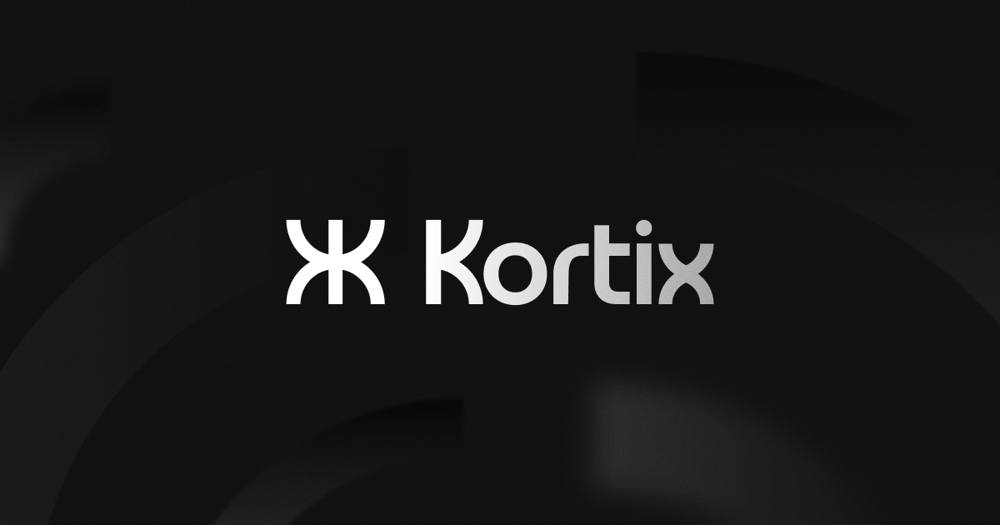

<div align="center">

# 🌿 CarbonScope

**AI-Powered BIM Carbon Analysis Platform**

Analyze, track, and reduce embodied carbon in building projects — with autonomous AI agents, BOQ analysis, TGO compliance, and real-time carbon advisory.

[](https://github.com/khiwniti/carbonscope)
[](https://github.com/khiwniti/carbonscope/issues)
[](LICENSE)

[English](#) | [ภาษาไทย](#thai-version)



</div>

---

## 🌟 What is CarbonScope?

CarbonScope is a comprehensive platform that combines **AI agent intelligence** with **BIM (Building Information Modeling)** workflows to help architects, engineers, and sustainability consultants:

- 📊 **Analyze embodied carbon** from Bill of Quantities (BOQ) data
- 🏗️ **Connect BIM models** to carbon databases and emission factors
- 🇹🇭 **TGO compliance** — aligned with Thailand Greenhouse Gas Management Organization standards
- 💬 **AI Carbon Advisor** — conversational agent for carbon reduction strategies
- 📁 **File intelligence** — upload BOQ files (Excel, PDF, CSV) for automatic carbon extraction
- 📈 **Analytics dashboard** — track carbon KPIs across projects and portfolios

---

## 🏗️ Platform Architecture

CarbonScope is built on four interconnected layers:

### 🤖 AI Agent Engine (Suna Core)
Python/FastAPI service with autonomous agent orchestration, LiteLLM integration (Claude, GPT-4, Groq), and a tool system for browser automation, file processing, and API connectivity.

### 🖥️ Frontend Dashboard
Next.js 15 / React 18 / TailwindCSS 4 application with:
- BOQ upload & carbon analysis views
- TGO emission factor lookup
- Carbon Advisor chat interface
- Agent management & configuration
- Real-time monitoring & analytics

### 🐳 Sandboxed Agent Runtime
Isolated Docker environments per agent instance — browser automation, code interpreter, file system access, and secure tool execution.

### 🗄️ Database & Storage
Supabase-powered data layer — auth, user management, project data, conversation history, file storage, and real-time subscriptions.

---

## 🚀 Quick Start

### Prerequisites
- Docker & Docker Compose
- Node.js 20+ & pnpm
- Python 3.11+ & uv
- Supabase account
- LLM API key (Anthropic / OpenAI / etc.)

### 1️⃣ Clone
```bash
git clone https://github.com/khiwniti/carbonscope.git
cd carbonscope
```

### 2️⃣ Configure
```bash
python setup.py
```
The interactive wizard guides you through all required services. Progress is saved — resume anytime if interrupted.

### 3️⃣ Start
```bash
python start.py start     # Start all services
python start.py stop      # Stop all services
python start.py status    # Show service status
python start.py restart   # Restart all services
```

### 4️⃣ Open
- **Frontend**: http://localhost:3000
- **Backend API**: http://localhost:8000
- **API Docs**: http://localhost:8000/docs

---

## 📋 View Logs

**Manual / Native:**
```bash
tail -f backend.log frontend.log
```

**Docker:**
```bash
docker compose logs -f
docker compose logs -f backend
docker compose logs -f frontend
```

---

## 🔑 Key Features

| Feature | Description |
|---|---|
| **BOQ Carbon Analysis** | Upload Bill of Quantities → auto-extract materials → map to emission factors |
| **TGO Lookup** | Thailand GHG Organization certified emission factors database |
| **Carbon Advisor Chat** | Conversational AI for reduction strategies and material substitutions |
| **Agent Builder** | Create custom agents for carbon workflows, reporting, and compliance |
| **BIM Integration** | Connect IFC/Revit models for automated quantity takeoff |
| **Portfolio Analytics** | Track carbon performance across multiple projects |
| **Thai Language Support** | Full UI and report localization in Thai (ภาษาไทย) |
| **Export & Reports** | Generate PDF/Excel carbon reports for clients and regulators |

---

## 🗂️ Project Structure

```
carbonscope/
├── apps/
│   ├── frontend/        # Next.js 15 web application
│   ├── mobile/          # React Native app
│   └── desktop/         # Electron desktop app
├── packages/
│   └── shared/          # Shared TypeScript types & utilities
├── backend/             # FastAPI Python backend
│   ├── core/            # Business logic & agent engine
│   ├── routers/         # API route handlers
│   └── tests/           # pytest test suite
├── sdk/                 # Python SDK for agent development
├── docs/                # Documentation
├── setup/               # Setup wizard
├── infra/               # Infrastructure as Code
├── setup.py             # Interactive setup wizard
└── start.py             # Platform process manager
```

---

## 🧑‍💻 Development

### Frontend
```bash
cd apps/frontend
pnpm install
pnpm dev          # Start dev server (Turbopack)
pnpm build        # Production build
pnpm lint         # ESLint
pnpm format       # Prettier
```

### Backend
```bash
cd backend
uv run python api.py              # Start API server
uv run pytest                     # Run all tests
uv run pytest -m e2e              # E2E tests only
uv run ruff check core/           # Lint
uv run ruff check --fix core/     # Auto-fix
```

---

## 🤝 Contributing

1. Fork the repository
2. Create a feature branch: `git checkout -b feat/my-feature`
3. Commit your changes: `git commit -m 'feat: add feature'`
4. Push to your branch: `git push origin feat/my-feature`
5. Open a Pull Request

Please follow the code style guidelines in [`AGENTS.md`](AGENTS.md).

---

## 🔒 Security

**Never commit API keys, tokens, or credentials to this repository.**

- Store secrets in `.env` files (already in `.gitignore`)
- Use GitHub Secrets for CI/CD
- Rotate any credentials that were accidentally exposed immediately via [GitHub Settings → Tokens](https://github.com/settings/tokens)

---

## 📄 License

[Apache 2.0](LICENSE) — see the LICENSE file for details.

---

<div align="center">

**Built for a low-carbon future 🌍**

[Issues](https://github.com/khiwniti/carbonscope/issues) • [Discussions](https://github.com/khiwniti/carbonscope/discussions) • [Docs](./docs)

</div>

---

<a name="thai-version"></a>
## 🇹🇭 CarbonScope ภาษาไทย

**แพลตฟอร์ม AI วิเคราะห์คาร์บอนสำหรับโครงการก่อสร้าง**

CarbonScope ช่วยให้สถาปนิก วิศวกร และที่ปรึกษาด้านความยั่งยืน สามารถ:

- 📊 วิเคราะห์คาร์บอนสะสม (Embodied Carbon) จากข้อมูล BOQ
- 🏗️ เชื่อมต่อโมเดล BIM กับฐานข้อมูลค่าการปล่อยก๊าซ
- 🇹🇭 รองรับมาตรฐาน **อบก. (TGO)** — องค์การบริหารจัดการก๊าซเรือนกระจก
- 💬 **ที่ปรึกษา AI** สำหรับกลยุทธ์ลดคาร์บอนแบบสนทนา
- 📈 แดชบอร์ดติดตาม KPI คาร์บอนรายโครงการ

```bash
git clone https://github.com/khiwniti/carbonscope.git
cd carbonscope && python setup.py
```
